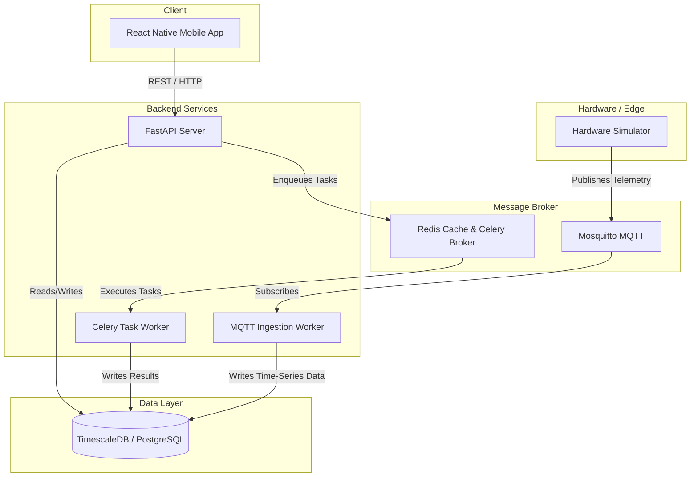

<div align="center">
  
  <h1 align="center">Rawbin Smart Composter Ecosystem</h1>
  <p align="center">
    <strong>A modern, BLE-enabled smart home composter platform with real-time telemetry and predictive analytics.</strong>
  </p>
  
  <p align="center">
    
    
    
    
  </p>
</div>

---

Welcome to **Rawbin**. This repository contains the complete software stack needed to run the backend services, telemetry ingestion, predictive analytics, and the premium web dashboard locally on your machine.

## 🏗 Architecture Overview

The system runs entirely locally using **Docker Compose** for the backend, alongside an **Expo React Native** application for the frontend:

- 🎨 **Mobile App (`mobile`)**: React Native (Expo) app with a premium "Rawbin-like" glassmorphic aesthetic, NativeWind (Tailwind CSS), SMS OTP login, and a dynamic hardware simulator.
- 🤖 **AI Features**: Integrated with Gemini 2.5 Flash for visual waste inspection (`/check-item-vision`) and zero-waste recipe generation.
- ⚡ **API (`api`)**: FastAPI backend for device pairing, auth, historical data, and AI processing endpoints.
- 🗄️ **Database (`db`)**: PostgreSQL 16 + TimescaleDB for high-performance time-series sensor readings.
- 🚀 **Cache & Broker (`redis`)**: Redis 7 for Celery message brokering and caching.
- 📡 **MQTT Broker (`mosquitto`)**: Eclipse Mosquitto for handling real-time telemetry from the IoT composter.
- 🔄 **Telemetry Ingestion (`mqtt_worker`)**: A standalone Python subscriber that writes incoming MQTT sensor data into TimescaleDB.
- ⚙️ **Job Queue (`worker`)**: Celery workers handling asynchronous alerts and predictive analytics.
- 🌡️ **Hardware Simulator (`simulator`)**: A Python script simulating a physical composter generating real-time temperature, moisture, and methane data.

### System Flow


---

## 🚀 Quickstart Guide

Running Rawbin locally is designed to be seamless. Everything is containerized and ready to go out of the box.

### 1. Prerequisites
Make sure you have the following installed on your machine:
- **[Docker Engine](https://docs.docker.com/get-docker/)** (or Docker Desktop)
- **Docker Compose** (included with Docker Desktop)

### 2. Setup Environment Variables
The backend requires some basic environment configuration.
```bash
# Navigate to the backend directory
cd backend

# Copy the example environment file
cp .env.example .env
```
*(The defaults in `.env.example` are pre-configured to work locally without any extra setup).*

### 3. Build & Start the Stack
From inside the `backend` folder, run Docker Compose to build the images and start all services in detached mode:
```bash
docker compose up -d --build
```
*Note: The initial build might take a few minutes as it downloads the Node, Python, Postgres, and Redis images.*

### 4. Run Database Migrations
Once the stack is running, initialize the database schema by running the Alembic migration command:
```bash
docker compose exec api alembic upgrade head
```

---

## 🎮 Using the Ecosystem

With the stack running, everything is immediately accessible!

### 📱 The Mobile App Features
- **Hardware Simulator**: Built right into the app's dashboard. Once you log in (using the seamless SMS OTP system), you can activate the simulator to instantly visualize live metrics and 30-day composting cycles!
- **Virtual Bin Avatar 🌱**: A "Digital Twin" Tamagotchi-style avatar on the dashboard that reacts in real-time to the MQTT telemetry (temperature & humidity) to show you how healthy your compost is.
- **AI Compost Checker 📸**: Tap the camera icon in the *Can It Compost?* tab to snap a photo of any waste item. Gemini AI will instantly tell you if it's compostable, recyclable, or trash!
- **Neighborhood Exchange 🤝**: A community marketplace tab where users can list their finished "Black Gold" or raw food scraps to trade with neighbors.
- **SaveMyFood Recipes 🍳**: Generate zero-waste recipes to use up leftovers before they go bad.

### 📱 Opening on Your Phone (Local Network Testing)
To view and interact with the premium Rawbin app on your mobile device:
1. Make sure your phone has the **Expo Go** app installed.
2. Ensure your phone and your computer are connected to the **same Wi-Fi network**.
3. Run `npx expo start` in the `mobile` folder.
4. Scan the QR code with your phone's camera (iOS) or Expo Go app (Android).
*(The app will automatically route API calls to your computer's backend over the local network).*

### ⚙️ API Documentation
- **URL**: [http://localhost:8000/docs](http://localhost:8000/docs)
- Interactive Swagger UI for testing the FastAPI backend endpoints directly.

### 🌸 Celery Monitoring (Flower)
- **URL**: [http://localhost:5555](http://localhost:5555)
- **Login**: `admin` / `admin` (or as configured in your `.env`)
- Monitor background tasks, alerts, and job queues in real-time.

---

## 🛠 Development Notes

- **🔥 Hot Reloading**: The FastAPI `api` and the `mobile` app support hot reloading. Changes made to Python files in `backend/app/` or React Native files in `mobile/src/` will automatically hot-reload the respective platforms.
- **🔐 Authentication**: Rawbin supports seamless SMS OTP login. Locally, SMS sending defaults to a "stub" mode (`SMS_PROVIDER=stub`). You can read the OTP codes directly from the `api` Docker logs to log in:
  ```bash
  docker compose logs -f api
  ```

---

## 🛑 Stopping the Stack

To cleanly stop the ecosystem and release ports:
```bash
cd backend
docker compose down
```

To stop the ecosystem *and* wipe all local database/redis data (useful for a complete clean reset):
```bash
docker compose down -v
```
