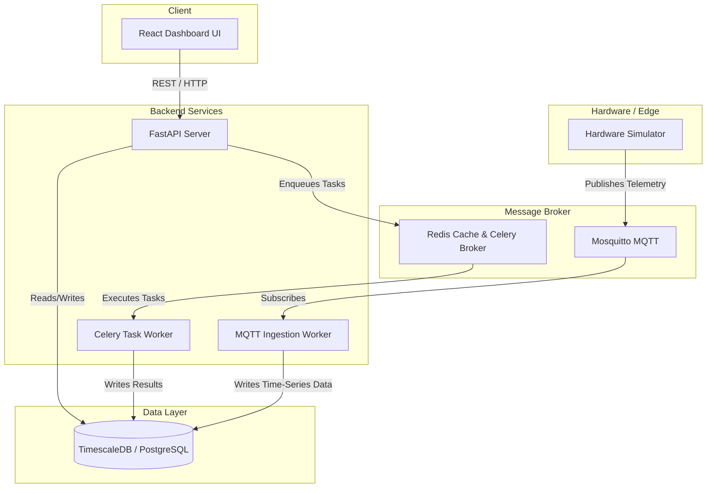

<div align="center">
  
  <h1 align="center">Rawbin Smart Composter Ecosystem</h1>
  <p align="center">
    <strong>A modern, BLE-enabled smart home composter platform with real-time telemetry and predictive analytics.</strong>
  </p>
  
  <p align="center">
    
    
    
    
  </p>
</div>

---

Welcome to **Rawbin**. This repository contains the complete software stack needed to run the backend services, telemetry ingestion, predictive analytics, and the premium web dashboard locally on your machine.

## 🏗 Architecture Overview

The system runs entirely locally using **Docker Compose**, orchestrating a modern, event-driven microservices architecture:

- 🎨 **Frontend (`frontend`)**: React + Vite SPA with a premium "Mill-like" glassmorphic aesthetic.
- ⚡ **API (`api`)**: FastAPI backend for device pairing, auth, and historical data.
- 🗄️ **Database (`db`)**: PostgreSQL 16 + TimescaleDB for high-performance time-series sensor readings.
- 🚀 **Cache & Broker (`redis`)**: Redis 7 for Celery message brokering and caching.
- 📡 **MQTT Broker (`mosquitto`)**: Eclipse Mosquitto for handling real-time telemetry from the IoT composter.
- 🔄 **Telemetry Ingestion (`mqtt_worker`)**: A standalone Python subscriber that writes incoming MQTT sensor data into TimescaleDB.
- ⚙️ **Job Queue (`worker`)**: Celery workers handling asynchronous alerts and predictive analytics.
- 🌡️ **Hardware Simulator (`simulator`)**: A Python script simulating a physical composter generating real-time temperature, moisture, and methane data.

### System Flow


---

## 🚀 Quickstart Guide

Running Rawbin locally is designed to be seamless. Everything is containerized and ready to go out of the box.

### 1. Prerequisites
Make sure you have the following installed on your machine:
- **[Docker Engine](https://docs.docker.com/get-docker/)** (or Docker Desktop)
- **Docker Compose** (included with Docker Desktop)

### 2. Setup Environment Variables
The backend requires some basic environment configuration.
```bash
# Navigate to the backend directory
cd backend

# Copy the example environment file
cp .env.example .env
```
*(The defaults in `.env.example` are pre-configured to work locally without any extra setup).*

### 3. Build & Start the Stack
From inside the `backend` folder, run Docker Compose to build the images and start all services in detached mode:
```bash
docker compose up -d --build
```
*Note: The initial build might take a few minutes as it downloads the Node, Python, Postgres, and Redis images.*

### 4. Run Database Migrations
Once the stack is running, initialize the database schema by running the Alembic migration command:
```bash
docker compose exec api alembic upgrade head
```

---

## 🎮 Using the Ecosystem

With the stack running, everything is immediately accessible!

### 🖥 The Web Dashboard
- **URL**: [http://localhost:3000](http://localhost:3000)
- The frontend is pre-configured to communicate with the local API.
- The **Hardware Simulator** automatically publishes fake composter data. Once you log in and "pair" a device, you will instantly see live metrics!

### 📱 Opening on Your Phone (Local Network Testing)
To view and interact with the premium Rawbin app on your mobile device:
1. Ensure your phone and your computer are connected to the **same Wi-Fi network**.
2. Find your computer's local IP address (e.g., `192.168.1.100` or `10.0.0.x`).
    - **Mac**: `System Settings > Network > Wi-Fi > Details`
    - **Windows**: Open Command Prompt and type `ipconfig` (look for "IPv4 Address").
3. Open your phone's browser and go to: `http://<YOUR_LOCAL_IP>:3000`
*(The app will automatically route API calls to your computer's backend over the local network).*

### ⚙️ API Documentation
- **URL**: [http://localhost:8000/docs](http://localhost:8000/docs)
- Interactive Swagger UI for testing the FastAPI backend endpoints directly.

### 🌸 Celery Monitoring (Flower)
- **URL**: [http://localhost:5555](http://localhost:5555)
- **Login**: `admin` / `admin` (or as configured in your `.env`)
- Monitor background tasks, alerts, and job queues in real-time.

---

## 🛠 Development Notes

- **🔥 Hot Reloading**: Both the FastAPI `api` and the React `frontend` have their source directories mounted into the Docker containers. Changes made to Python files in `backend/app/` or React files in `frontend/src/` will automatically hot-reload the respective servers.
- **🔐 Authentication**: Rawbin supports SMS OTP login. Locally, SMS sending defaults to a "stub" mode (`SMS_PROVIDER=stub`). You can read the OTP codes directly from the `api` Docker logs to log in:
  ```bash
  docker compose logs -f api
  ```

---

## 🛑 Stopping the Stack

To cleanly stop the ecosystem and release ports:
```bash
cd backend
docker compose down
```

To stop the ecosystem *and* wipe all local database/redis data (useful for a complete clean reset):
```bash
docker compose down -v
```
