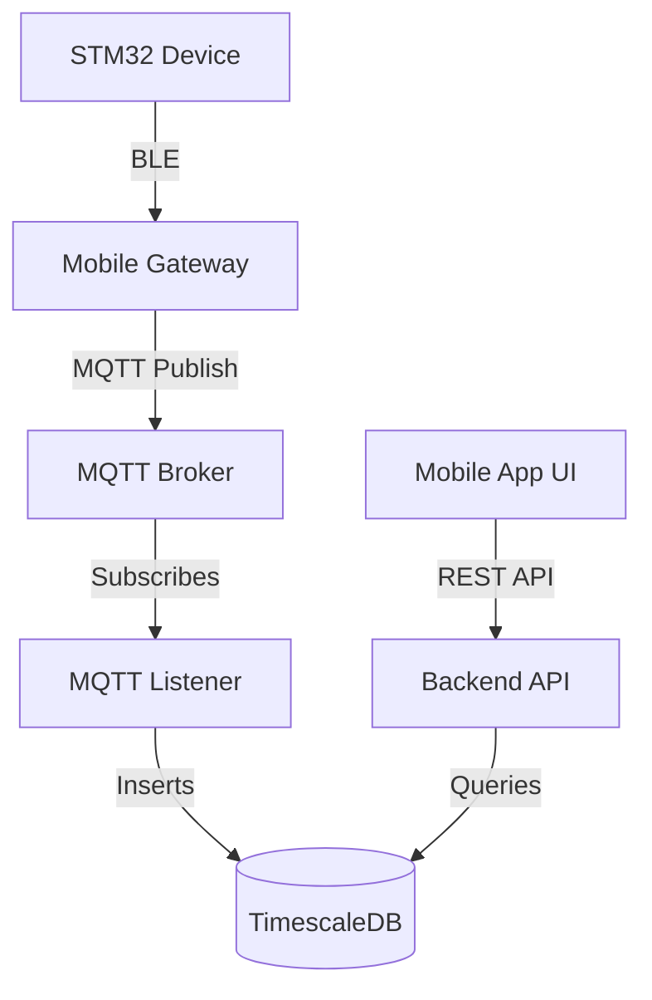

<div align="center">
  
  
  
  
</div>

# ⚙️ Rawbin Backend Services

The core logic and data engine for the **Rawbin Smart Composter Ecosystem**. This backend operates as a highly concurrent BLE→MQTT/HTTPS gateway, managing real-time IoT ingestion, complex predictive analytics, and user authentication.

---

## 📡 The Data Gateway Pipeline

The physical bin (STM32 + sensors) talks over Bluetooth to the mobile app, which acts as a BLE→MQTT gateway.


## 🚀 Processes Architecture

The system runs as **separate processes**, each with a single responsibility to ensure scalability and fault tolerance:

| Process | Command | Role |
|---|---|---|
| **API** | `uvicorn app.main:app` | REST API for the frontend (auth, devices, telemetry, plants, AI). |
| **MQTT Worker** | `python -m app.workers.mqtt_listener` | **Sole** telemetry ingestion: writes sensor readings to the hypertable. |
| **Celery Worker** | `celery -A app.workers.celery_app worker` | Post-ingestion background jobs: AI analytics, alert evaluation, push notifications. |
| **Flower** | `celery -A app.workers.celery_app flower` | Visual monitoring UI for Celery task queues. |

> **⚠️ Critical Design Note:** Ingestion is strictly MQTT-only. There is intentionally no HTTP telemetry-ingestion endpoint. This decouples the ingestion pipeline from the API, ensuring that API restarts never interrupt hardware telemetry data collection.

## 🗄️ Database & Data Models

Built on PostgreSQL 16 and TimescaleDB for ultra-fast time-series queries.
- **`users`**: User accounts securely linked to Firebase/OTP authentication.
- **`user_devices`**: Junction table permitting secure, multi-user household access to a single composter.
- **`devices`**: Registered composters.
- **`sensor_readings`**: **TimescaleDB hypertable**, partitioned into 7-day chunks to handle millions of rows of temperature, moisture, and methane telemetry.
- **`compost_cycles`**: Tracks the batch lifecycle (`active → curing → completed`).
- **`waste_logs`**: Logs individual additions of food scraps (`greens|browns|food|other`) to calculate diverted landfill mass.
- **`plants` & `compost_applications`**: The Garden feature, linking finished compost batches to real-world plant health.

## 🔒 Security & Authentication
- **Human Users:** Authenticate via SMS OTP, receiving a 15-minute JWT access token and a 30-day hashed refresh token.
- **Devices:** Hardware securely authenticates with the MQTT broker using cryptographic HMAC challenge/responses. The API never trusts untampered device payloads.

## 📂 Code Layout
```text
app/
  main.py            # FastAPI initialization & DB lifespan
  api/v1/            # API Routers (auth, telemetry, analytics, garden, ai)
  core/              # Configuration, MQTT client, Security, JWT logic
  db/                # SQLAlchemy Models & Connection Pooling
  schemas/           # Pydantic validation models
  services/          # Decoupled business logic (OTP, access control)
  workers/           # Celery tasks and continuous MQTT ingestion loop
```

## 🛠 Local Development
To run the backend independently:
```bash
# 1. Fill in secrets
cp .env.example .env       

# 2. Start the database and services
docker compose up --build  

# 3. Create the database tables
docker compose exec api alembic upgrade head
```
**API Docs:** [http://localhost:8000/docs](http://localhost:8000/docs)
